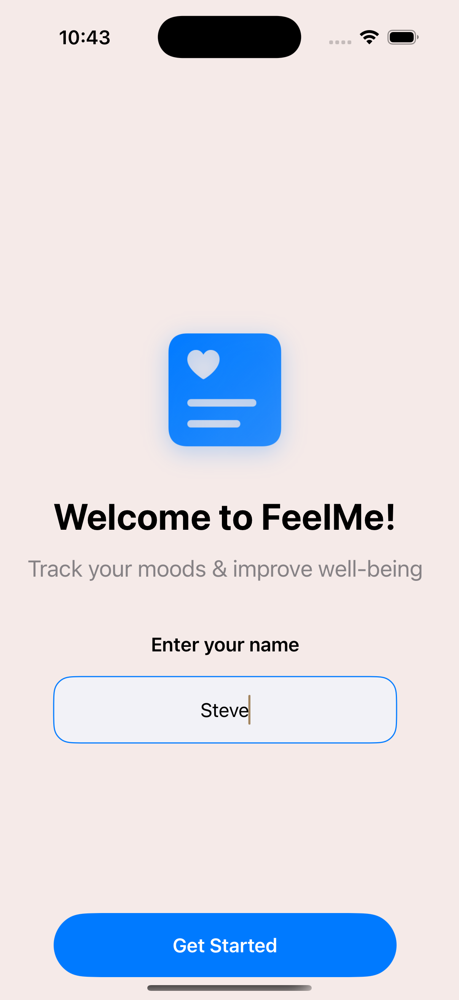
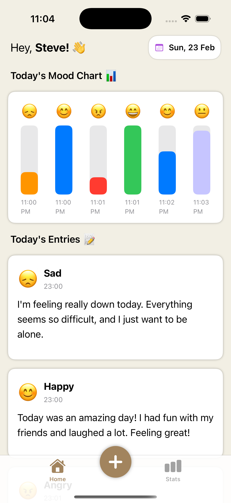
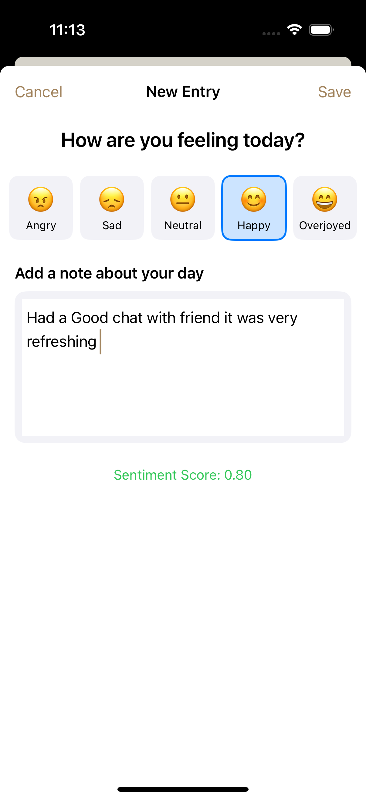
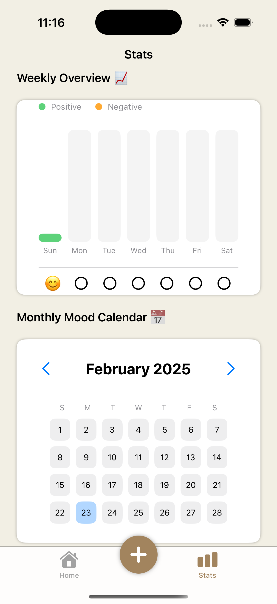

# FeelMe


## 📌 Project Overview
FeelMe is an intuitive mood tracking and sentiment analysis app designed to help users monitor their emotional well-being. By logging daily moods and journal entries, the app analyzes sentiment trends and provides insights to improve mental health.


## ✨ Features
- 📅 **Mood Tracking**: Log daily moods using emojis.
- 📝 **Journaling**: Write short journal entries.
- 🤖 **Sentiment Analysis**: AI-powered analysis of journal entries to determine mood trends.
- 📊 **Mood Calendar**: View and track mood trends over time.
- 🎯 **Happiness Goals**: Personalized goals based on mood patterns.
- 🔒 **Privacy First**: Works entirely offline using Core Data for storage.

## 🛠️ Tech Stack
- **Programming Language**: Swift
- **Frameworks**: SwiftUI, Core Data, Core ML
- **AI/ML**: Sentiment analysis with Core ML
- **Database**: Core Data (Offline storage)

## 🚀 Installation
1. Clone the repository:
   ```sh
   git clone https://github.com/yourusername/FeelMe.git
   ```
2. Open the project in Xcode.
3. Build and run on a simulator or device.

## 📸 Screenshots
| Launch Screen | Home Screen | Mood Entry | Mood Calendar |
|------------|-----------|--------------|--------------|
|  |  |  |  |

## 🤝 Contribution
Feel free to contribute to this project:
- Fork the repository
- Create a feature branch
- Submit a pull request

## 📜 License
This project is licensed under the MIT License - see the [LICENSE](LICENSE) file for details.

## 📬 Contact
For any inquiries, reach out at [Gmail](roshangomes5@gmail.com) or connect on [LinkedIn](https://www.linkedin.com/in/roshan-gomes/).

---
Made with ❤️ by Roshan Steve Gomes

